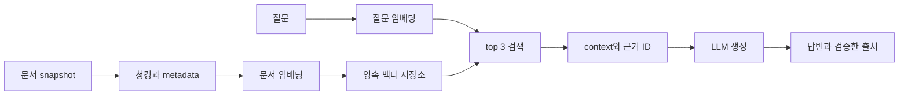

# 6주 커리큘럼과 일별 산출물

기준은 하루 6시간, 주 5일입니다. 권장 일일 배분은 자료 확인 45분, 구현 3시간 30분, 검증 1시간, 보고서와 회고 45분입니다. 아래 일차는 추천 순서이며 날짜는 교육자와 정합니다.

매일 이전 내용을 10분 정도 떠올리고 실제 입력을 하나 바꾸어 확인합니다. 완료 기준은 코드가 있는지보다 실행·설명·검증 근거가 있는지로 판단합니다.

## 1주차 Python 자료형과 NumPy pandas 기초

환경, 기본 자료형, 함수와 파일, ndarray, DataFrame. 주간 실습은 Wine 데이터 처리 CLI와 기초 연산 노트입니다.

| 일차 | ID | 작업 | 산출물 | 시간 |
| --- | --- | --- | --- | --- |
| 1 | L01 | 환경과 Python 기본 실행 | 환경 기록과 작은 실행 예제 | 6 h |
| 2 | L02 | Python 자료형과 자료구조 | 자료형 비교와 참조·복사 노트 | 6 h |
| 3 | L03 | 함수와 모듈 파일 예외 | 함수·파일 처리와 CLI 골격 | 6 h |
| 4 | L04 | NumPy 배열과 벡터 연산 | shape·axis·broadcasting 검증 노트 | 6 h |
| 5 | L05 | pandas 기초와 Wine CLI | Wine 요약 JSON과 필터 CSV | 6 h |

**주간 통과 기준:** 입력과 필터 조건을 바꿔 실행하고, 함수의 반환값·배열 axis·DataFrame 선택을 설명한다.

[과제](week01/README.md) · [체크리스트](week01/CHECKLIST.md)

## 2주차 pandas 데이터 처리와 머신러닝

결측, 변환, 집계와 결합, 분할, baseline, Pipeline, 평가. 주간 실습은 Titanic 분류와 재사용 가능한 예측 CLI입니다.

| 일차 | ID | 작업 | 산출물 | 시간 |
| --- | --- | --- | --- | --- |
| 6 | L06 | pandas 정리 집계 결합 | 결측·dtype·groupby·merge 기록 | 6 h |
| 7 | L07 | 분할과 baseline 평가 | 고정 분할과 Dummy 평가 | 6 h |
| 8 | L08 | 전처리 Pipeline과 모델 비교 | 동일 조건 모델 2개 비교표 | 6 h |
| 9 | L09 | 오류 분석과 모델 저장 | holdout·오류 사례·재로드 비교 | 6 h |
| 10 | L10 | ML CLI와 재현 리뷰 | 학습·예측 명령과 실패 입력 기록 | 6 h |

**주간 통과 기준:** 전처리 fit 대상과 데이터 분할을 코드에서 보여주고 저장한 Pipeline으로 새 입력을 예측한다.

[과제](week02/README.md) · [체크리스트](week02/CHECKLIST.md)

## 3주차 딥러닝과 Attention 기본 연산

tensor, autograd, MLP, 학습·검증, 저장, Q K V와 mask. 주간 실습은 FashionMNIST MLP와 작은 Attention 연산입니다.

| 일차 | ID | 작업 | 산출물 | 시간 |
| --- | --- | --- | --- | --- |
| 11 | L11 | tensor autograd와 DataLoader | 배치 shape와 gradient 확인 | 6 h |
| 12 | L12 | MLP forward와 loss | 모델 구조와 loss 입력 표 | 6 h |
| 13 | L13 | 학습 루프와 지표 기록 | epoch별 loss·accuracy 기록 | 6 h |
| 14 | L14 | 검증 저장과 별도 추론 | 곡선·오분류·재로드·test 결과 | 6 h |
| 15 | L15 | Attention shape와 causal mask | Q K V와 mask 전후 출력 노트 | 6 h |

**주간 통과 기준:** 학습 루프와 별도 추론을 재현하고 QK 전치 곱과 mask의 shape를 설명한다.

[과제](week03/README.md) · [체크리스트](week03/CHECKLIST.md)

## 4주차 LLM 추론과 프롬프트 실험

tokenizer, causal LM, chat template, 생성 설정, CLI와 평가. 주간 실습은 작은 사전학습 LLM 질문 응답 CLI입니다.

| 일차 | ID | 작업 | 산출물 | 시간 |
| --- | --- | --- | --- | --- |
| 16 | L16 | tokenizer와 causal LM 입력 | 토큰·입력 길이·template 노트 | 6 h |
| 17 | L17 | 사전학습 LLM 실제 추론 | 모델 생성과 장치·시간 기록 | 6 h |
| 18 | L18 | 프롬프트와 생성 설정 비교 | 동일 질문 설정 비교와 JSON 파싱 | 6 h |
| 19 | L19 | LLM CLI와 로그 오류 | 반복 질문 CLI와 결과 JSONL | 6 h |
| 20 | L20 | LLM 품질 평가와 리뷰 | 10개 질문 평가와 한계 보고 | 6 h |

**주간 통과 기준:** 사전학습 모델을 실제로 불러와 생성하고 token·template·설정·출력 흐름과 실패를 설명한다.

[과제](week04/README.md) · [체크리스트](week04/CHECKLIST.md)

## 5주차 문서 청킹 임베딩과 검색 평가

문서 snapshot, metadata, chunk, embedding, cosine, TF IDF와 검색. 주간 실습은 Python 문서 검색기와 개발 평가셋입니다.

| 일차 | ID | 작업 | 산출물 | 시간 |
| --- | --- | --- | --- | --- |
| 21 | L21 | 문서 확보와 평가 질문 분리 | snapshot 목록과 개발 질문 20개 | 6 h |
| 22 | L22 | 청킹과 metadata 추적 | chunk 목록과 토큰 절단 점검 | 6 h |
| 23 | L23 | 임베딩과 NumPy cosine 검색 | 벡터 shape와 직접 계산 top-3 | 6 h |
| 24 | L24 | TF IDF와 dense 검색 비교 | 동일 개발 질문 top-3 비교표 | 6 h |
| 25 | L25 | 검색 Recall 평가와 manifest | Recall@3·실패 분석·index 설정 | 6 h |

**주간 통과 기준:** 질문과 문서의 벡터를 설명하고 top-3 근거를 원문에서 찾으며 검색 실패를 생성 실패와 구분한다.

[과제](week05/README.md) · [체크리스트](week05/CHECKLIST.md)

## 6주차 RAG 연결 벡터 저장소와 최종 평가

Chroma 저장, retrieval, context, 생성, 근거·거절, 평가와 재현. 주간 실습은 근거를 제시하는 문서 질문 응답 RAG CLI입니다.

| 일차 | ID | 작업 | 산출물 | 시간 |
| --- | --- | --- | --- | --- |
| 26 | L26 | Chroma 저장과 검색 재현 | 인덱스 생성·재로드·검색 비교 | 6 h |
| 27 | L27 | 검색 context와 LLM 연결 | RAG 답변과 실제 근거 로그 | 6 h |
| 28 | L28 | RAG 거절 오류와 재인덱싱 | 실패·근거 부족·갱신 검증표 | 6 h |
| 29 | L29 | RAG 비교와 최종 평가 | 세 방식 비교와 최종 10개 채점 | 6 h |
| 30 | L30 | RAG 최종 시연과 인수인계 | 재현 README와 리뷰 반영 결과 | 6 h |

**주간 통과 기준:** 새 프로세스에서 인덱스를 읽어 실제 LLM 답변과 근거를 출력하고 최종 평가·실패 사례를 설명한다.

[과제](week06/README.md) · [체크리스트](week06/CHECKLIST.md)

## 최종 RAG 흐름

검색, 생성, 근거 검증과 평가를 각각 확인합니다. 자세한 평가 조건은 [EVALUATION.md](EVALUATION.md)에 있습니다.
